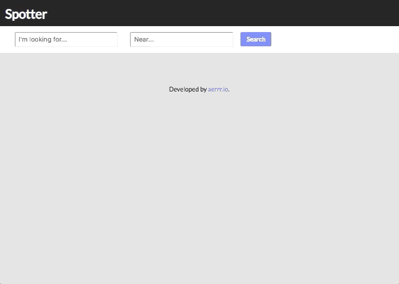
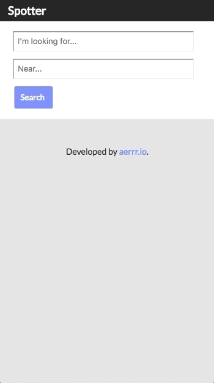

# Spotter
A React project. CSS written with SASS. Spotter uses the Yelp Fusion API.

## Application Breakdown
User fills in both input fields, and searches the Yelp API for businesses in an area. If either input field is empty, an error message will appear and a Yelp call will not happen. 

The output will result the best matching businesses with cards on the screen. There is a Desktop and Mobile-friendly view.

## Desktop View

## Mobile View

